# Homework

The goal of this homework is to create a simple training pipeline, use mlflow to track experiments and register best model, but use Mage for it

We'll use NYC taxi dataset, the **Yellow** taxu data for March, 2023

## Question 1. Run Mage

First, let's run Mage with Docker Compose

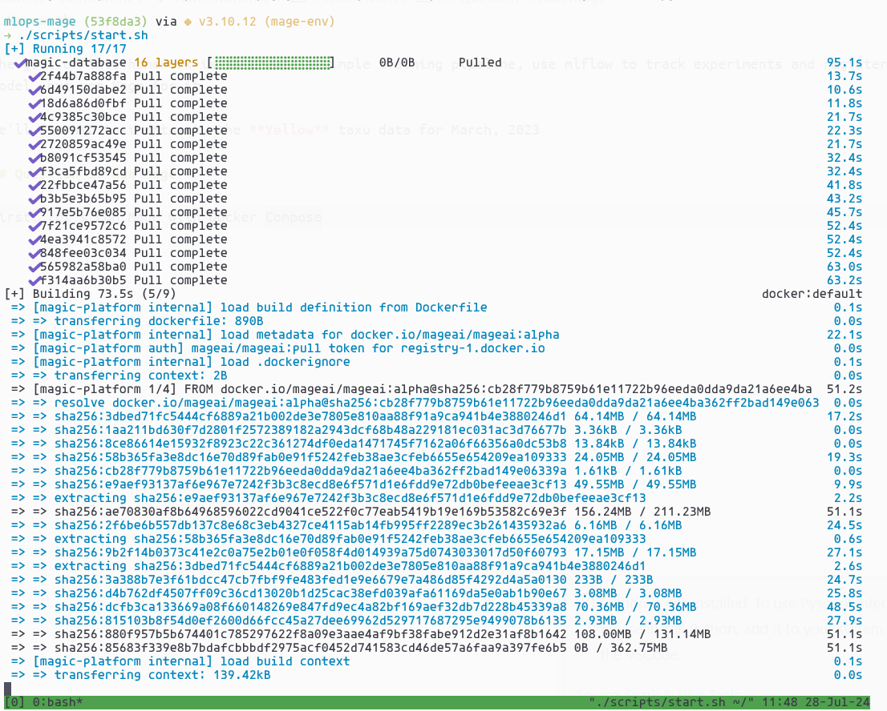
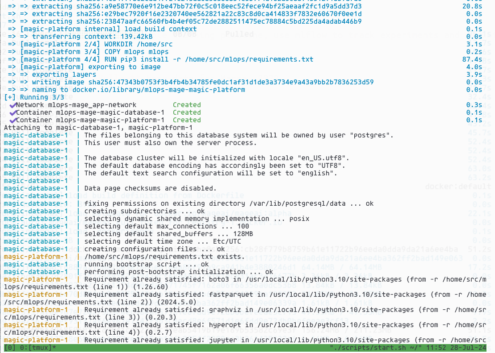

What's the version of Mage

* Version v0.9.72

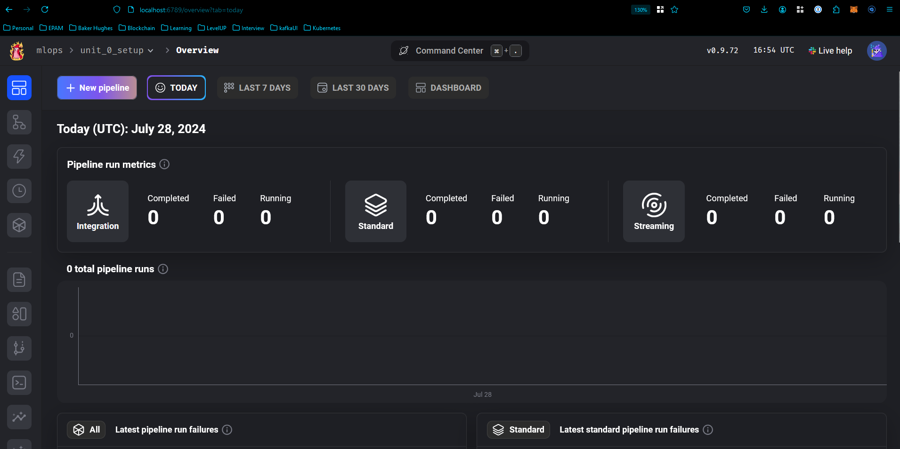

## Question 2. Creating a project

Now let's create a new project. We will call it **homework_03**

How many lines are in the created `metadata.yaml` file

* 55

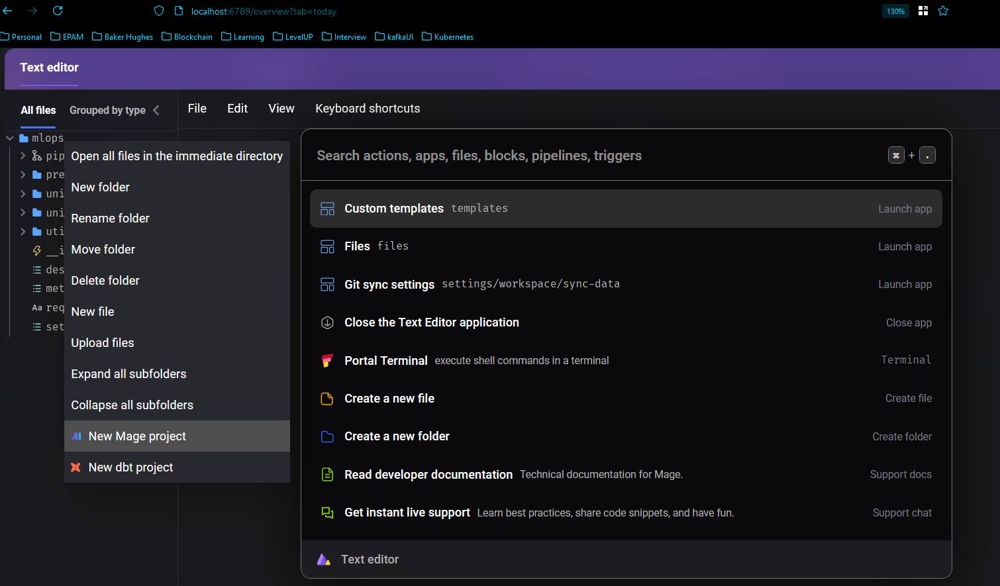
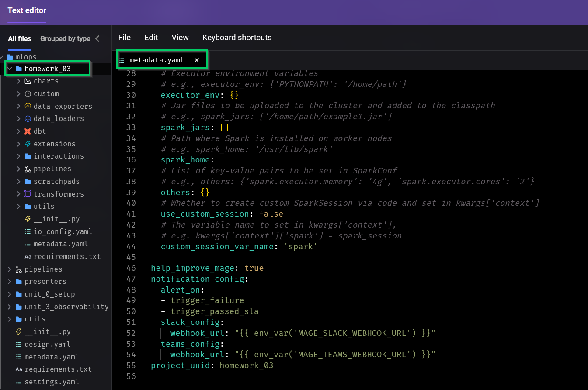

## Question 3. Creating a pipeline

Let's create an ingestion code block

Read the March 2023 Yellow taxi trips data.

How many records did we load?

* 3,403,766

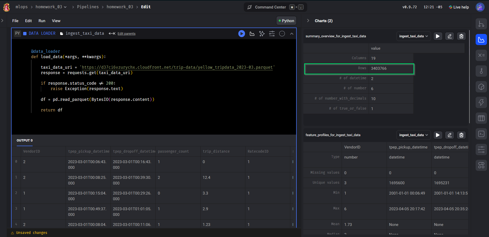

## Question 4. Data preparation

Let's use the same logic for preparing the data we used previously. We will create a transformer code block and put this code there.

```python
def read_dataframe(filename):
    df = pd.read_parquet(filename)

    df.tpep_dropoff_datetime = pd.to_datetime(df.tpep_dropoff_datetime)
    df.tpep_pickup_datetime = pd.to_datetime(df.tpep_pickup_datetime)

    df['duration'] = df.tpep_dropoff_datetime - df.tpep_pickup_datetime
    df.duration = df.duration.dt.total_seconds() / 60

    df = df[(df.duration >= 1) & (df.duration <= 60)]

    categorical = ['PULocationID', 'DOLocationID']
    df[categorical] = df[categorical].astype(str)
    
    return df
```

Let's adjust it and apply to the data we loaded in question 3.

What's the size of the result?

* 3,316,216

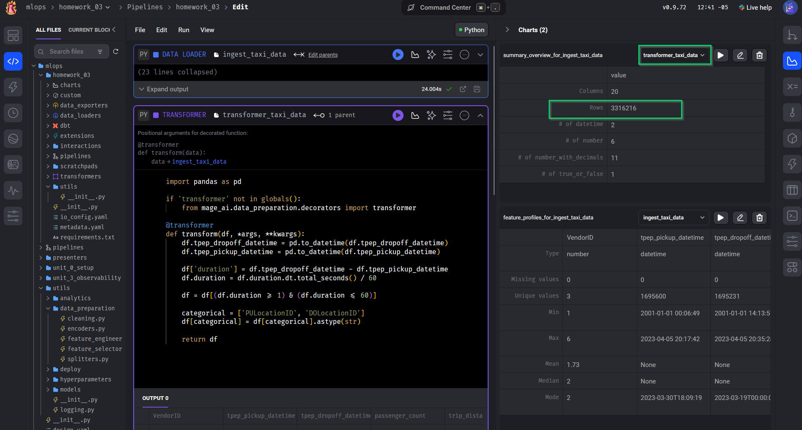

## Question 5. Train a model

Train a linear regression model using the same code as in homework 1.

* Fit a dict vectorizer
* Train a linear regression with default parameters
* Use pick up and drop off locations separately, don't create a combination feature

Create another transformation block, and return the dict vectorizer and the model.

What's the intercept of the model?

* 24.77

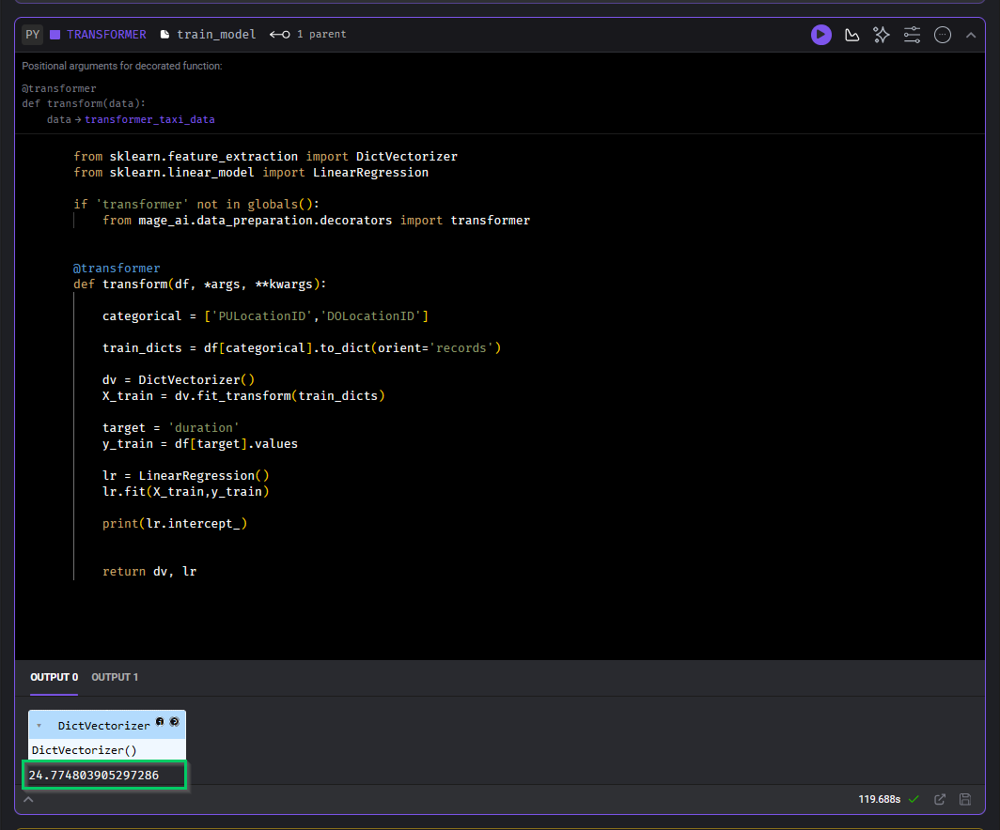

## Question 6. Register the model

The model is trained, so let's save it with MLFlow

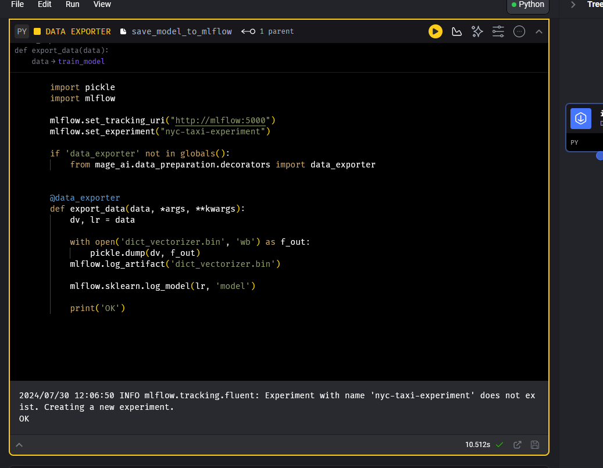
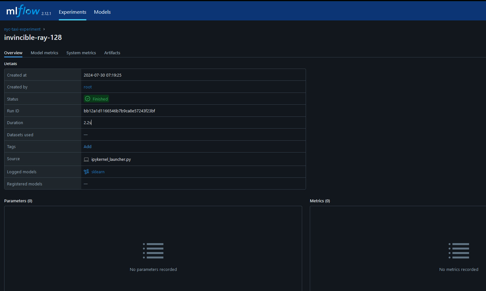

Find the logged model, and find MLModel file. What's the size of the model? (`model_size_bytes` field):

* 4,534

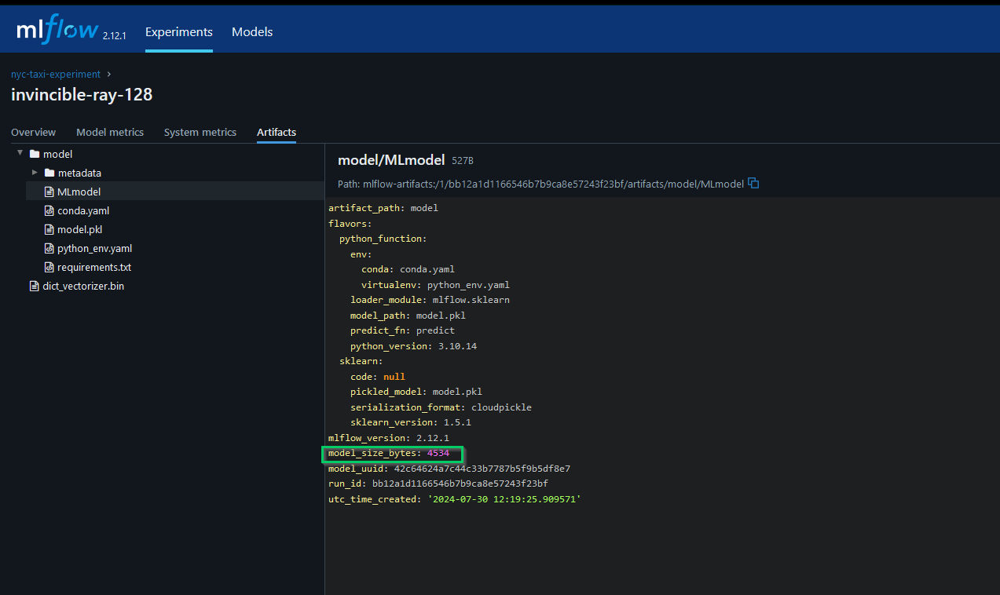
