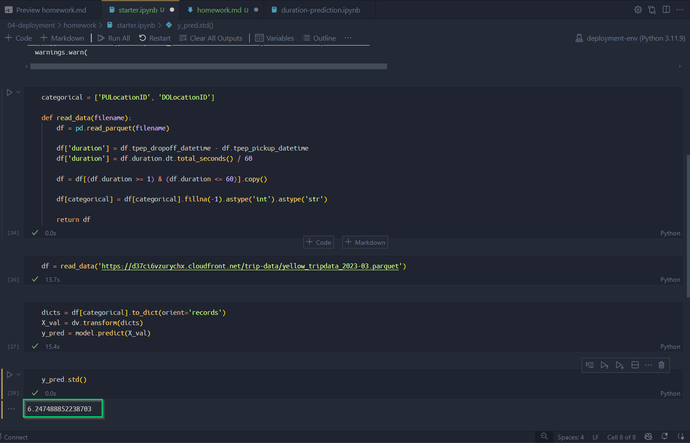
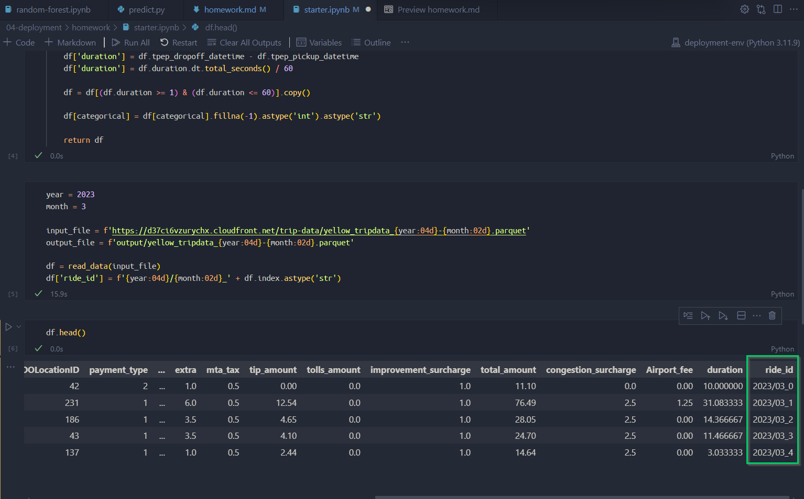
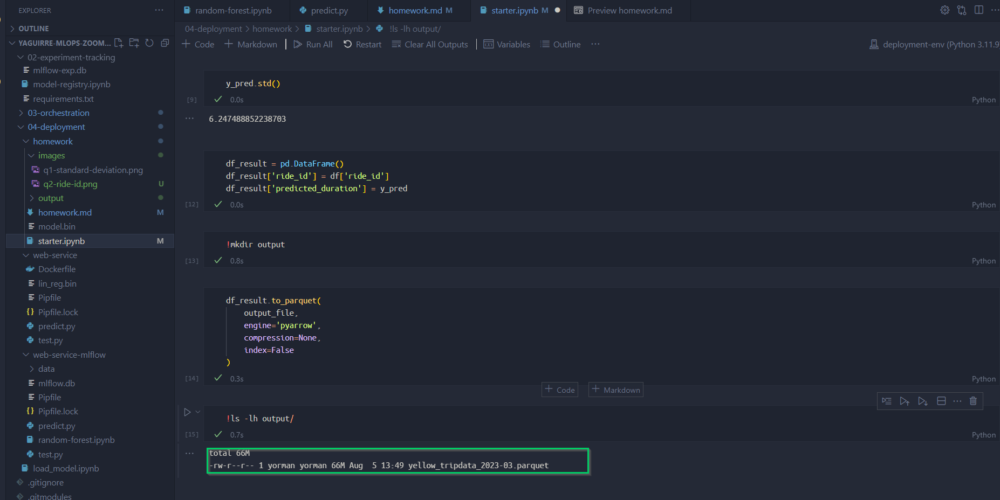
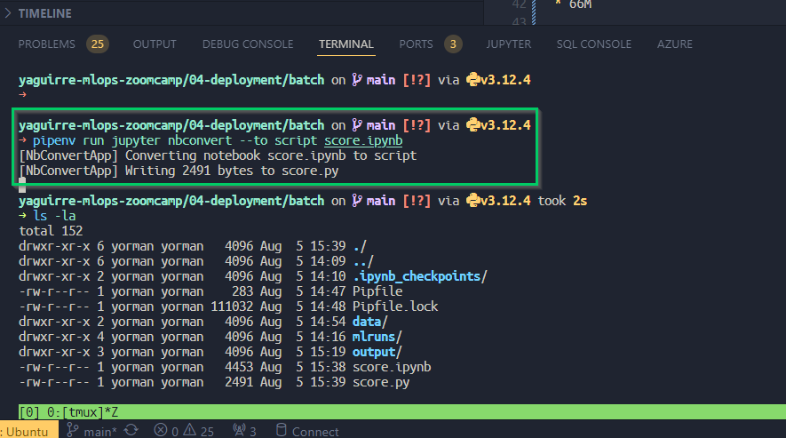
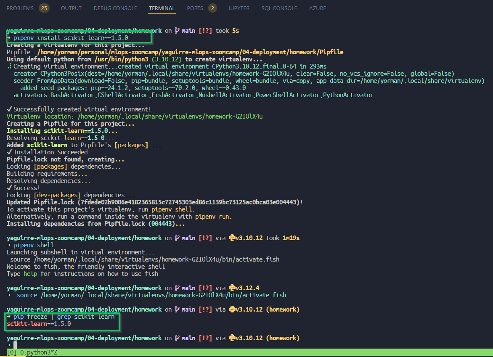
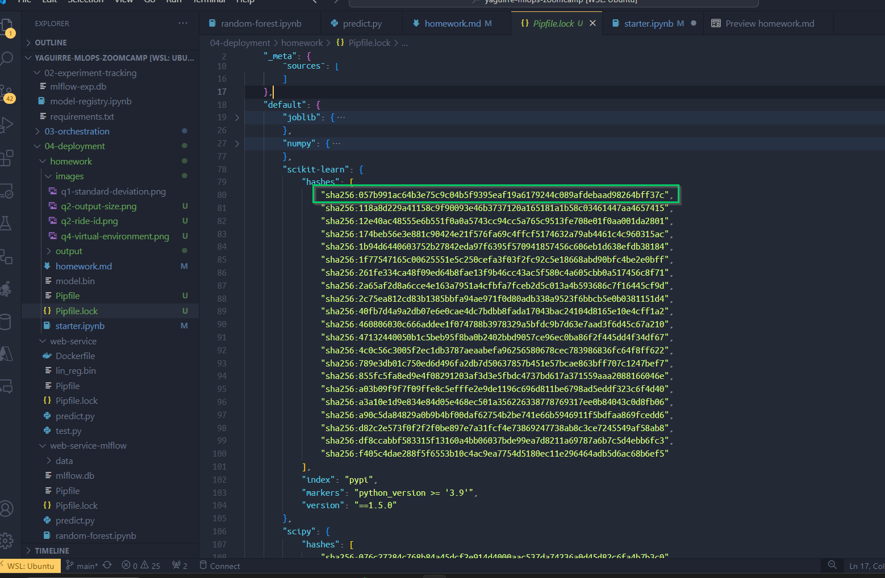
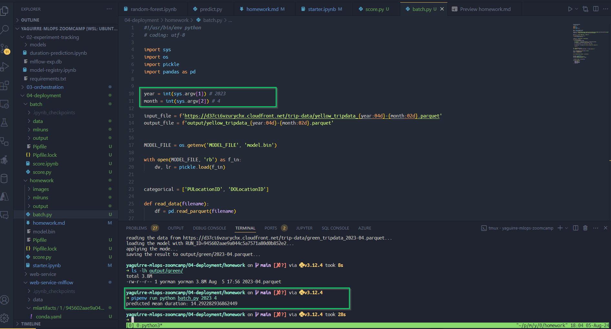
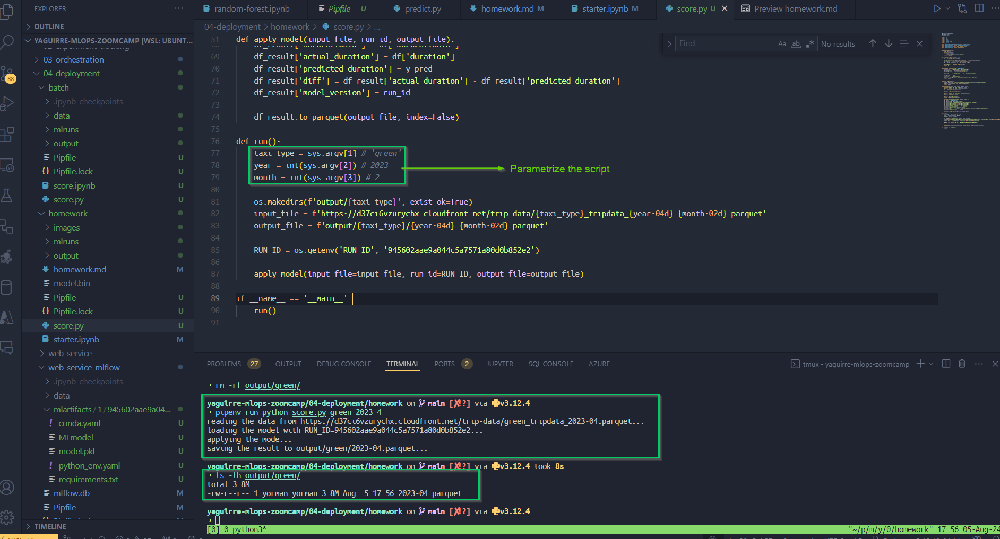
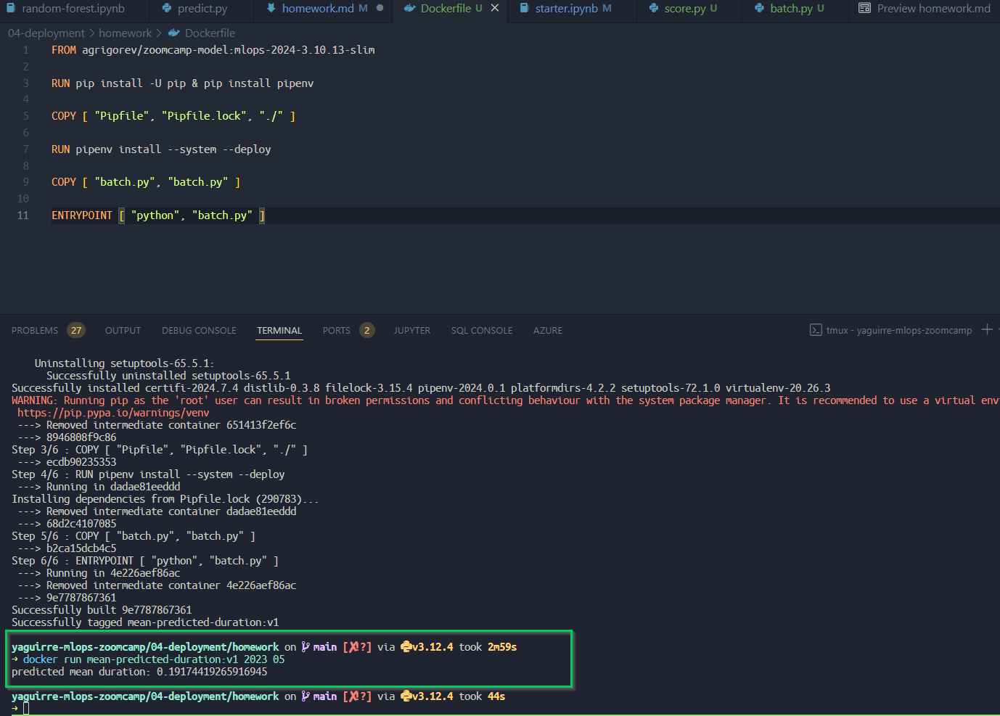

# Homework

In this homework, we'll deploy the ride duration model in batch mode. Like in homework 1, we'll use the Yellow Taxi Trip Records dataset.

## Question #1. Notebook

We'll start with the same notebook we ended up with in homework 1. 

Run the notebook for the March 2023 data.

What's the standard deviation of the predicted duration for this dataset?

* 6.24



## Question #2. Preparing the output

Like in the course videos, we want to prepare the dataframe with the output.

First, let's create an artificial ride_id column:

```python
df['ride_id'] = f'{year:04d}/{month:02d}_' + df.index.astype('str')
```

Next, write the ride id and the predictions to a dataframe with results.

Save it as parquet:

```python
df_result.to_parquet(
    output_file,
    engine='pyarrow',
    compression=None,
    index=False
)
```

What's the size of the output file?

* 66M




## Question #3. Creating the scoring script

Now let's turn the notebook into a script

Which command you need to execute for that?

* `jupyter nbconvert --to script score.ipynb`



## Question #4. Virtual environment

Now let's put everything into a virtual environment. We'll use `pipenv` for that

Install all the required libraries. Pay attention to the Scikit-learn version: It should be the same as in the starter notebook

What's the first hash for the Scikit-Learn dependency?

* `"sha256:057b991ac64b3e75c9c04b5f9395eaf19a6179244c089afdebaad98264bff37c"`




## Question #5. Parametrize the script

Let's now make the script configurable via CLI. We'll create two parameters: year and month

Run the script for April 2023

What's the mean predicted duration?

* 14.29



Another parametrization using `score.py` example



## Question #6. Docker container

Run the script with Docker. What's the mean predicted duration for May 2023?

* 0.19

