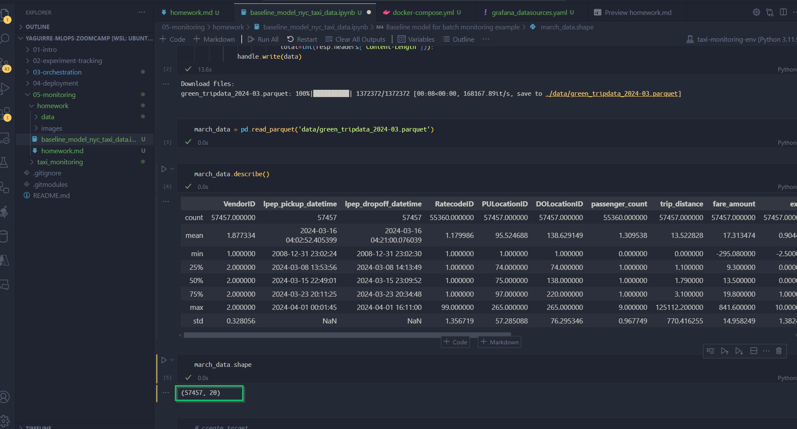
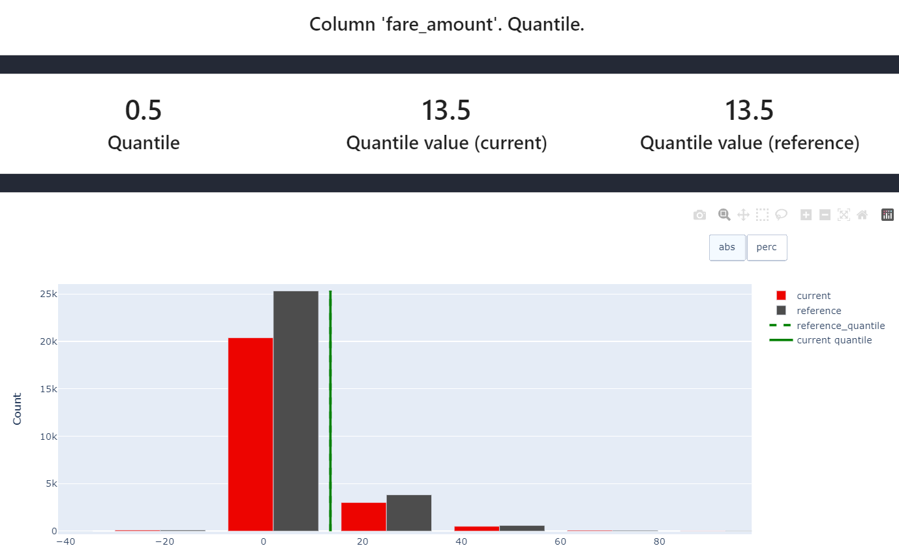
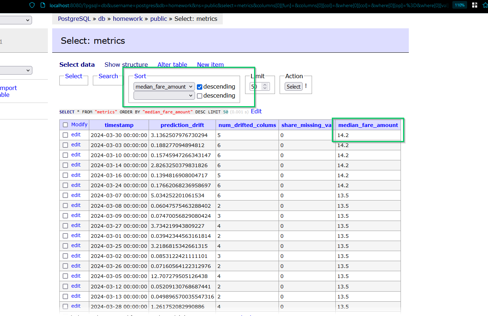
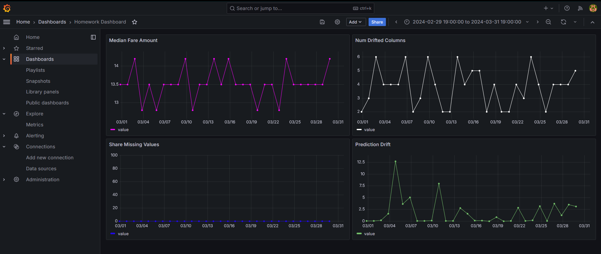

# Homework

The goal of this homework is to familiarize users with monitoring for ML batch services, using PostgreSQL database to store metrics and Grafana to visualize them

## Question #1. Prepare the dataset

Start with `baseline_model_nyc_taxi_data.ipynb`. Download the March 2024 Green Taxi data. We will use this data to simulate a production usage of taxi trip duration prediction service.

What is the shape of the downloaded data? How many rows are there?

* 72044
* 78537 
* **`57457`**
* 54396

## Question #2. Metric

Let's expand the number of data quality metrics we'd like to monitor! Please add one metric of your choice and a quantile value for the `"fare_amount"` colum (`quantile=0.5`).

What metric did you choose?

* **`ColumnQuantileMetric`**

## Question #3. Monitoring

Let's start monitoring. Run expanded monitoring for a new batch of data (March 2024).

What is the maximum value of metric `quantile = 0.5` on the `"fare_amount"` column during March 2024 (calculated daily)?

* 10
* 12.5
* **`14.2`** Check `home_metrics_calculation.py` for implementation details
* 14.8

## Question #4. Dashboard

Finally, let’s add panels with new added metrics to the dashboard. After we customize the  dashboard let's save a dashboard config, so that we can access it later. Hint: click on “Save dashboard” to access JSON configuration of the dashboard. This configuration should be saved locally.

Where to place a dashboard config file?

* project_folder (05-monitoring)
* project_folder/config  (05-monitoring/config)
* **`project_folder/dashboards`**  (05-monitoring/dashboards)
* project_folder/data  (05-monitoring/data)

