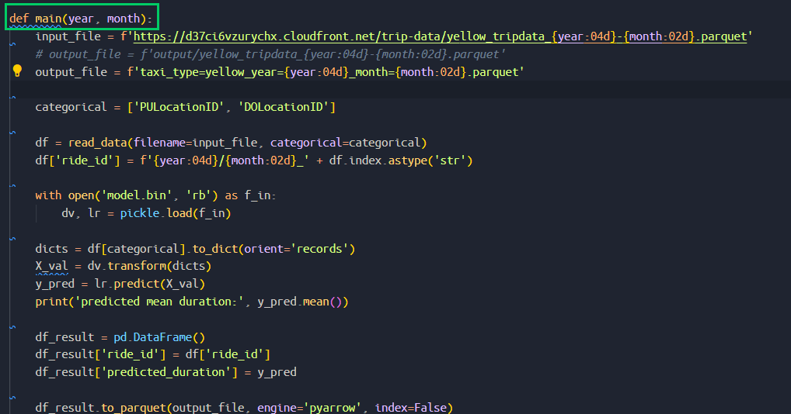
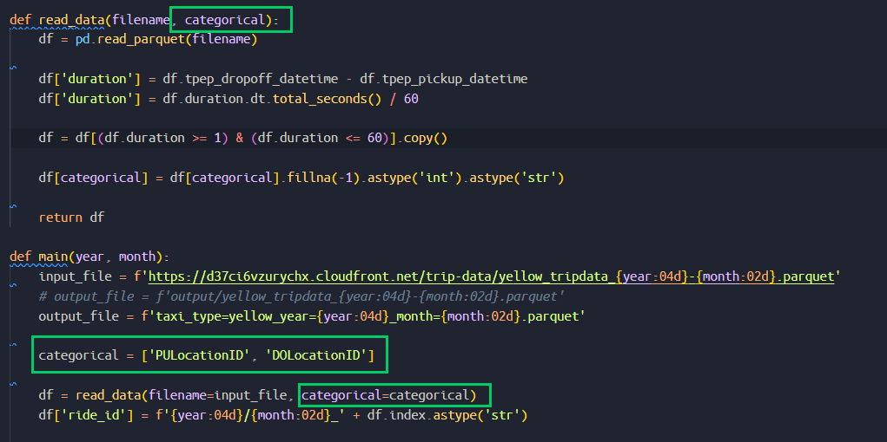
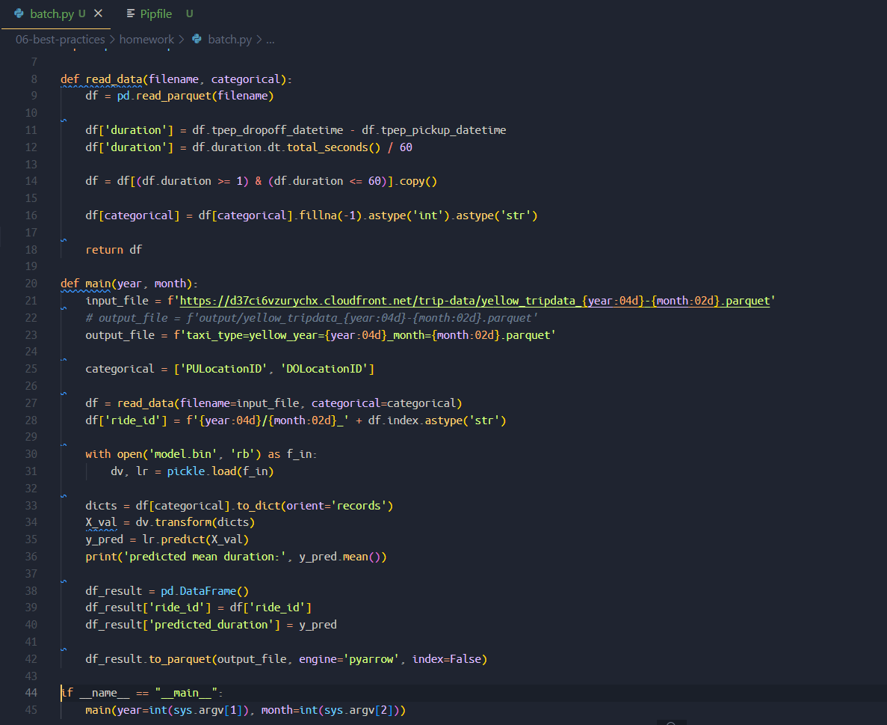
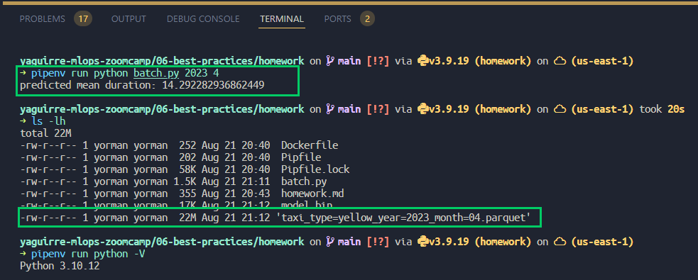
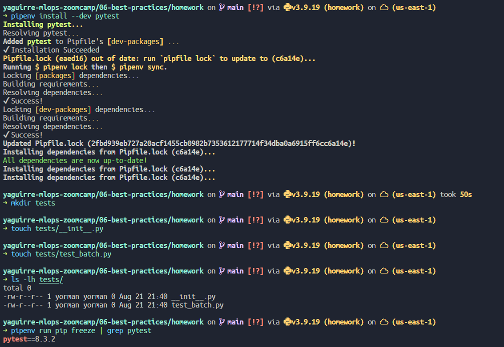
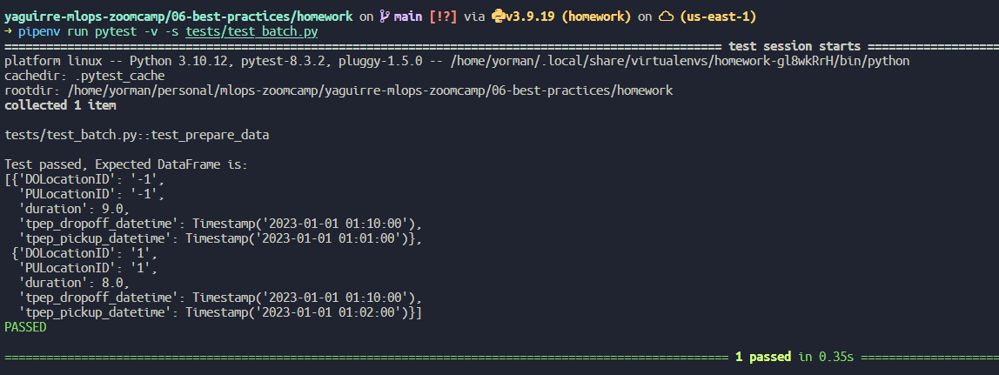

# Homework

In this homework, we'll take the ride duration prediction model that we deployed in batch mode in homework 4 and improve the reliability of our ccode with unit and integration tests.

## Question #1. Refactoring

Before we can start covering our code with tests, we need to refactor it. We'll start by getting rid of all the global variables.

* Let's create a function `main` with two parameters: `year` and `month`.
* Move all the code (except `read_data`) inside `main`



* Make `categorical` a parameter for `read_data` and pass it inside `main`



Now we need to create the "main" block from which we'll invoke the main function. How does the `if` statement that we use for this looks like?

```python
if __name__ == "__main__":
    main(year=int(sys.argv[1]), month=int(sys.argv[2]))
```

To make it easier to run it, you can write results to your local filesystem

```python
output_file = f'taxi_type=yellow_year={year:04d}_month={month:02d}.parquet'
```



After refactoring, check that code still works. **Run it for March 2023 and see if it finishes successfully.**



## Question #2. Installing pytest

Now we need to install `pytest`:

```bash
pipenv install --dev pytest
```

Next create a folder `tests` and create two files. One will be the file with tests. We can name it `test_batch.py`

What should be the other file?

Hint: to be able to test `batch.py`, we need to be able to import it. Without this file, we won't be able to do it.

* The other file to create has to be `__init__.py` 



## Question #3.  Writing first unit test

Now let's cover our code with unit tests.

We'll start with the pre-processing logic inside `read_data`.

It's difficult to test right now because first reads the file and then performs some transformations. We need to split this code into two parts: reading (I/O) and transformation.

So let's create a function `prepare_data` that takes in a dataframe (and some other parameters too) and applies some transformation to it.

(That's basically the entire `read_data` function after reading the parquet file)

Now create a test function and use this as input:

```python
data = [
    (None, None, dt(1, 1), dt(1, 10)),
    (1, 1, dt(1, 2), dt(1, 10)),
    (1, None, dt(1, 2, 0), dt(1, 2, 59)),
    (3, 4, dt(1, 2, 0), dt(2, 2, 1)),      
]

columns = ['PULocationID', 'DOLocationID', 'tpep_pickup_datetime', 'tpep_dropoff_datetime']
df = pd.DataFrame(data, columns=columns)
```

Where `dt` is a helper function

```python
from datetime import datetime

def dt(hour, minute, second=0):
    return datetime(2023, 1, 1, hour, minute, second)
```

Define the expected output and use the assert to make sure that the actual dataframe matches the expected one.

Tip: When you compare two Pandas DatraFrames, the result is also a DataFrame. The same is true for Pandas Series. Also, a DataFrame could be turned into a list of dictionaries.

How many rows should be there in the expected dataframe?

* 1
* `2`  See `tests/test_batch.py` for more details
* 3
* 4



## Question #4. Mocking S3 with LocalStack